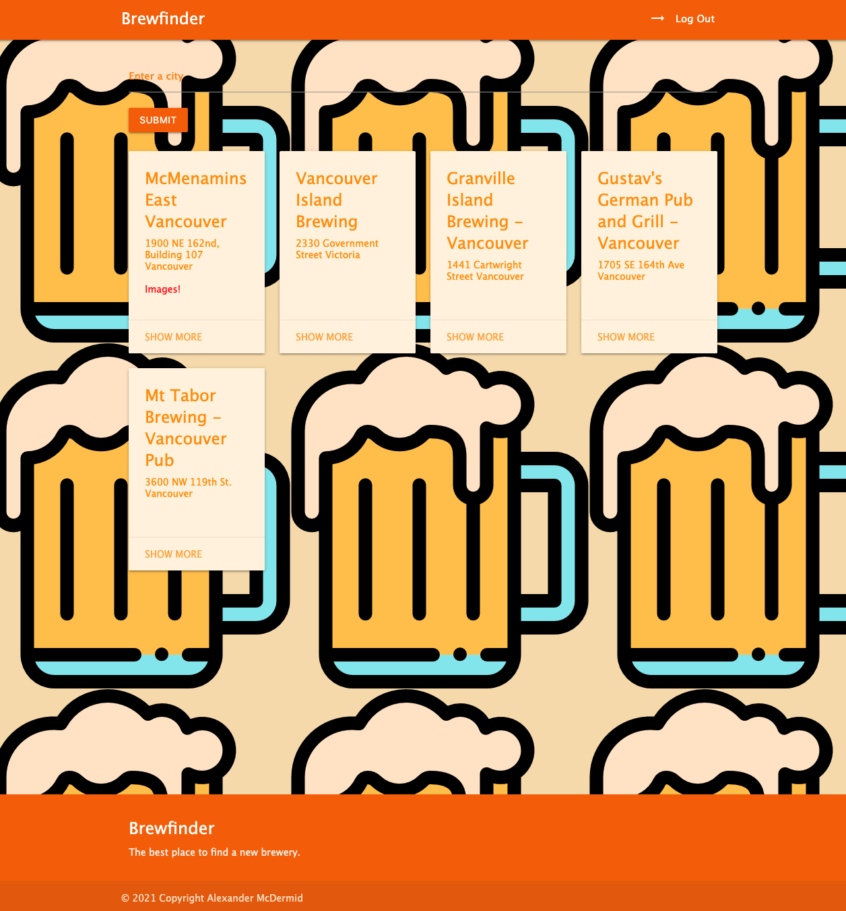
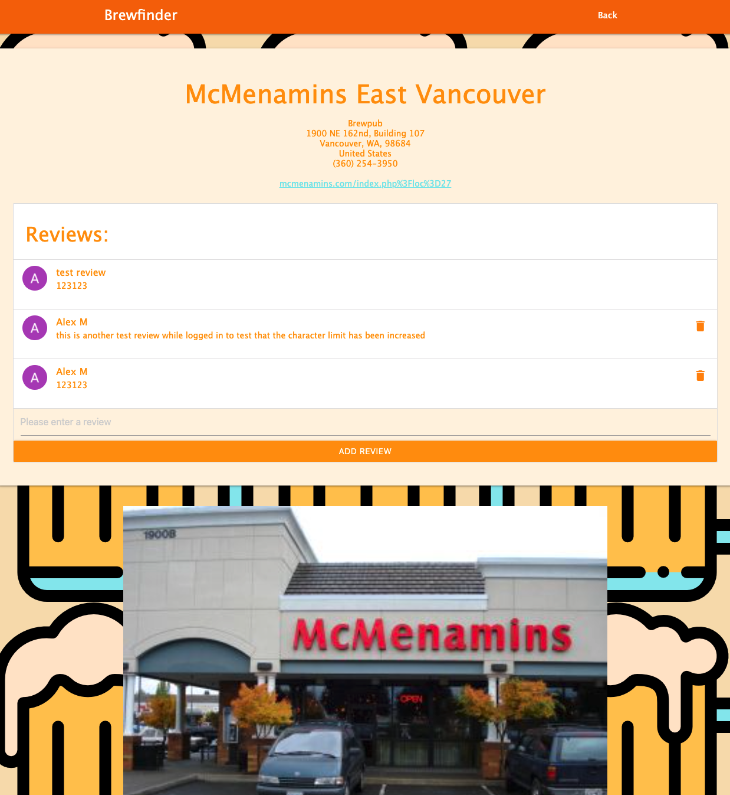

# brewfinder webapp for a class project
## Description
### This brewfinder webapp allows users to search cities, states or provinces to find a listing of breweries. The brewery listings can be expanded to show more information, including photos and reviews. Reviews can be made by users when logged into a google account on the webapp.

## Technologies
### This project used technologies such as node.js, express, mongodb, js, html and css.
## Getting started
### https://brewfinderwebapp.herokuapp.com/
### https://trello.com/b/r9pGkxHy/webapp
## Next steps
### I would like to fix the google redirects so that logging in doesn't always redirect to '/' with no search query. For example a user should be able to login on the show page and be redirected to the show page. 
### Other interesting features could be added like allowing users to save a list of breweries they would like to visit - from here some sort of brewery crawl fucntionality could be implemented where the app helps users plan a night out.